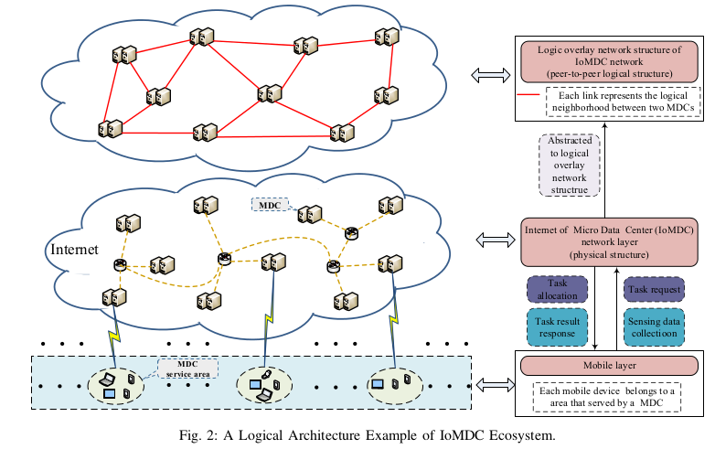

## RBDS(Raspberrypi-Based Distributing System)搭建及配置 ##
----------- 
### 背景介绍 ###

----------- 
### 基本框架结构 ###
 

----------- 
### 准备工作 ### 
+ PC端(用于开发) 
	* 操作系统: Linux(Ubuntu, Archlinux等均可), 我自己用的是Ubuntu14.04LTS, 以下均按照Ubuntu系统为例说明
	* Python版本:python2.x 
	* 安装及配置git: [github简明教程](http://www.runoob.com/w3cnote/git-guide.html) 
	* 安装Flask: 
		```bash 
		$ sudo apt-get install python-pip
		$ sudo pip install Flask
		``` 
	* 安装docker: 
		```bash
		$ sudo apt-get install docker.io
		``` 
	* 获取源代码: 
		```bash 
		$ sudo git clone https://github.com/wenbo1188/distribute.git project_path
		``` 
+ 树莓派端(用于部署应用, Raspberry Pi 3 Model B) 
	* 操作系统: ubuntu-mate([树莓派官网](https://www.raspberrypi.org/downloads/)上可以下载ubuntu-mate的镜像, 可以用[imagewriter](https://sourceforge.net/projects/win32diskimager/)把镜像写入microSD(此软件是在windows下的=_=).
	* 树莓派账户及密码: raspberry1(2-6)(根据盒子上的标号分别为1-6), 密码均为raspberrypi
	* [安装docker](http://hugozhu.myalert.info/2015/04/12/60-run-docker-on-raspberry-pi.html): 这篇教程讲的是在树莓派上配置archlinux系统后安装docker的过程, 仅供参考, 其实用ubuntu-mate也可以安装docker, 方法见PC端.
	* 部署应用: 
	```bash 
	$ sudo git clone https://github.com/wenbo1188/distribute.git project_path 
	$ cd project_path
	$ sudo pip install -e . 
	``` 
	* 使用方法及模块介绍: 